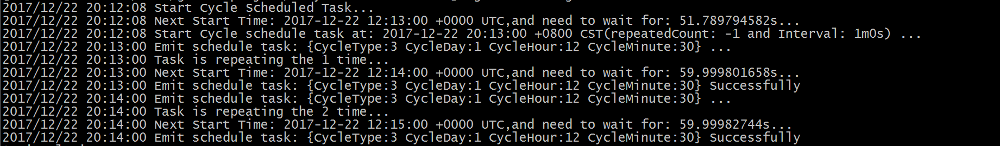

# GoCycleSchedulerModel

Golang Model for Cycle Scheduler

## Principle

GoCycleSchedulerModel currently supports four cycle scheduler(Never Stop) type as below:

* Week: Execute task once a week and start either this week or next week
* Day: Execute task every day and start either today or tomorrow
* Hour: Execute task every hour and start one hour later
* Minute: Execute task every minute and start one minute later

## Build

```
mkdir -p /data/go/src
export GOPATH=/data/go
mkdir /data/duyanghao
cd /data/duyanghao
git clone https://github.com/duyanghao/GoCycleSchedulerModel.git
cd /data/duyanghao/GoCycleSchedulerModel
ln -s $PWD/Scheduler $GOPATH/src/Scheduler
export GOPATH=$PWD:$GOPATH
go build
```

## Test



## Breakdown of schedule string. (ISO 8601 Notation)

Example `schedule` string:

```
R2/2017-06-04T19:25:16.828696-07:00/PT10S
```

This string can be split into three parts:

```
Number of times to repeat/Start Datetime/Interval Between Runs
```

#### Number of times to repeat

This is designated with a number, prefixed with an `R`. Leave out the number if it should repeat forever.

Examples:

* `R` - Will repeat forever
* `R1` - Will repeat once
* `R231` - Will repeat 231 times.

#### Start Datetime

This is the datetime for the first time the job should run.

Kala will return an error if the start datetime has already passed.

Examples:

* `2017-06-04T19:25:16`
* `2017-06-04T19:25:16.828696`
* `2017-06-04T19:25:16.828696-07:00`
* `2017-06-04T19:25:16-07:00`

*To Note: It is recommended to include a timezone within your schedule parameter.*

#### Interval Between Runs

This is defined by the [ISO8601 Interval Notation](https://en.wikipedia.org/wiki/ISO_8601#Time_intervals).

It starts with a `P`, then you can specify years, months, or days, then a `T`, preceded by hours, minutes, and seconds.

Lets break down a long interval: `P1Y2M10DT2H30M15S`

* `P` - Starts the notation
* `1Y` - One year
* `2M` - Two months
* `10D` - Ten days
* `T` - Starts the time second
* `2H` - Two hours
* `30M` - Thirty minutes
* `15S` - Fifteen seconds

Now, there is one alternative. You can optionally use just weeks. When you use the week operator, you only get that. An example of using the week operator for an interval of every two weeks is `P2W`.

Examples:

* `P1DT1M` - Interval of one day and one minute
* `P1W` - Interval of one week
* `PT1H` - Interval of one hour.

### More Information on ISO8601

* [Wikipedia's Article](https://en.wikipedia.org/wiki/ISO_8601)

## Refs

* [Breakdown of schedule string. (ISO 8601 Notation)](https://github.com/duyanghao/kala#breakdown-of-schedule-string-iso-8601-notation)
* [RichardKnop/machinery](https://github.com/RichardKnop/machinery)
* [Go by Example: Base64 Encoding](https://gobyexample.com/base64-encoding)
* [time Weekday](https://golang.org/pkg/time/#Weekday)
* [Quickly getting to YYYY-mm-dd HH:MM:SS in Perl](https://stackoverflow.com/questions/1814196/quickly-getting-to-yyyy-mm-dd-hhmmss-in-perl)
* [Converting string to json or struct in GoLang](https://stackoverflow.com/questions/40429296/converting-string-to-json-or-struct-in-golang)
